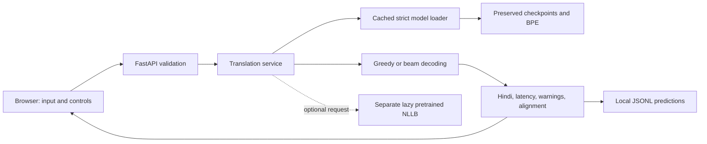

# English-to-Hindi Neural Machine Translation Chatbot

**MSc — Neural Networks and Deep Learning**  
Team: [Names and student IDs] · Institution: [Institution] · Supervisor: [Name]

## Abstract

This project studies English-to-Hindi neural machine translation through three trained architectures: a GRU encoder-decoder, a GRU with Bahdanau attention and an encoder-decoder Transformer implemented from scratch. The final improved Transformer uses a one-million-pair training subset and an Epoch-19 checkpoint. Its locked official evaluation on 2,507 pairs is BLEU 5.8019 and chrF 28.7418 with beam size 4 and length penalty 0.6. A separately identified pretrained NLLB reference achieves the locked scores BLEU 23.4315 and chrF 51.0445. The application exposes preserved checkpoints using FastAPI, with a browser interface for translation, comparison, genuine attention alignment and prediction logging. No training or official evaluation was repeated during application completion.

## 1. Problem and objectives

English and Hindi differ in typical word order, morphology and writing system. A translator must learn semantic correspondences and generate a coherent target sequence of potentially different length. The objectives are to implement and compare increasingly expressive neural architectures, explain attention and decoding, preserve an honest evaluation record and demonstrate inference interactively.

The interface is described as a translation chatbot because it accepts a user's sentence and returns a translation. It has no conversation memory or general question-answering capability.

## 2. Dataset and preprocessing

Saved EDA output identifies the IIT Bombay English-Hindi corpus: 1,659,083 training pairs, 520 validation pairs and 2,507 test pairs. The cleaning notebook normalizes leading/trailing and repeated whitespace, removes empty pairs and exact duplicate translation pairs, and retains sentences of 1–50 words in both languages. It samples fixed 300,000-pair and 1,000,000-pair training subsets with random seed 42. Validation and official test serve different purposes; neither is used for application smoke tests.

The local application copy lacks `data/`; dataset facts come from existing notebook records. Inference needs only checkpoints and tokenizers. No data was downloaded, reconstructed, changed or evaluated for this completion task.

SentencePiece BPE represents text as subword pieces, providing reusable word fragments for rare words. Each source/target vocabulary has 16,000 entries. Verified special IDs are PAD=0, UNK=1, BOS=2, EOS=3. Original GRUs use `english_bpe.model` and `hindi_bpe.model`; the final Transformer uses the `_1m` pair. Model input is bounded at 64 tokens, retaining 62 content pieces between BOS/EOS and explicitly warning about truncation. GRU inputs are padded; packed sequences keep padding out of recurrent state computation.

## 3. GRU baseline

The encoder embeds English pieces into 256 dimensions and passes them through a single-layer GRU with 512 hidden units. The final hidden state initializes a Hindi GRU decoder with the same dimensions. A linear projection maps each decoder state to 16,000 vocabulary logits. The architecture has 18,765,440 parameters and the local best checkpoint is Epoch 3.

The notebook records learning rate 0.001, teacher-forcing ratio 0.5, gradient clipping 1.0, a maximum of 10 epochs and early-stopping patience 3. These are historical settings, not instructions to train again. At inference, greedy decoding feeds the previously predicted token back into the decoder. A single fixed encoder state can lose detail on long sentences.

## 4. Bahdanau attention GRU

The attention encoder retains all source hidden states. At each target step, additive attention computes

`e(t,s) = V(tanh(W_encoder h_s + W_decoder h_(t-1)))`.

Masked softmax creates weights over non-padding source positions. The context is their weighted sum. The decoder GRU consumes the target embedding concatenated with this context. Its output, context and embedding are concatenated into 1,280 features, projected to 512, transformed by tanh and projected to the 16,000-token vocabulary. This later notebook decoder version is essential to match the saved checkpoint.

The model uses 256-dimensional embeddings, 512-dimensional hidden and attention spaces, one recurrent layer and 20,733,569 parameters. Epoch 4 is selected. The UI heatmap exposes genuine inference weights: English source pieces on columns and generated Hindi pieces on rows. Source BOS/EOS are retained, source PAD columns are omitted and rows for non-displayed target special tokens are excluded. Attention weights describe alignment behavior and are not a guarantee of faithful explanation.

## 5. Transformer from scratch

The selected model uses two token embeddings, scaled by sqrt(d_model), and sinusoidal positional encoding. Each attention block manually projects Q/K/V, splits heads, computes scaled dot products, masks forbidden positions, applies softmax and combines weighted values through an output projection. Encoder blocks contain self-attention, residual connections, LayerNorm and a position-wise FFN. Decoder blocks add causal self-attention and cross-attention over encoder memory.

| Parameter | Verified value |
|---|---:|
| Source / target vocabulary | 16,000 / 16,000 |
| d_model | 384 |
| Heads / dimensions per head | 8 / 48 |
| Encoder / decoder layers | 4 / 4 |
| FFN hidden dimension | 1,536 |
| Dropout | 0.1 |
| Maximum sequence length | 64 |
| Parameters | 35,012,224 |
| Selected epoch | 19 |

Source padding masks suppress PAD positions. The target mask combines padding with a lower-triangular causal mask, preventing access to future target positions. Cross-attention uses decoder states as queries and encoder memory as keys/values. The architecture uses manually implemented attention rather than `nn.Transformer`, `nn.MultiheadAttention` or a pretrained Transformer.

The improved training notebook records label smoothing 0.1, Adam betas (0.9, 0.98), epsilon 1e-9 and 4,000 warmup steps with the Transformer learning-rate schedule. CUDA mixed precision is used where enabled by the historical training code. The application performs ordinary evaluation-mode inference with gradients disabled. No optimizer or training loop runs in the application.

## 6. Decoding

Greedy search chooses the highest-logit token at each step. Beam search retains multiple candidate prefixes, accumulating log probabilities. The preserved notebook ranks candidates using `score / max(1, length_without_BOS)^0.6`, with beam width 4. Completed and remaining beams are compared with the same normalization. This is the notebook's length formula, not a substituted alternative.

Both modes stop on EOS or a bounded number of steps. Special PAD/BOS/EOS tokens are omitted from displayed text. Non-finite logits and invalid vocabulary dimensions raise explicit errors. Empty output, unknown pieces, input truncation and generation without EOS produce warnings; they are never replaced with invented translations.

## 7. Evaluation and interpretation

| Model | BLEU | chrF | Category |
|---|---:|---:|---|
| GRU Baseline | 1.3797 | 14.3026 | Trained by team |
| GRU + Bahdanau Attention | 2.4331 | 18.9274 | Trained by team |
| Transformer From Scratch | 5.8019 | 28.7418 | Trained by team |
| NLLB — Tool-Assisted / Pretrained Reference | 23.4315 | 51.0445 | External pretrained reference |

BLEU measures reference token n-gram precision with a brevity penalty. chrF measures character n-gram precision/recall and captures partial morphological overlap. Higher is better for both; neither is a percentage of semantically correct sentences.

The final scratch test uses 2,507 pairs, Epoch 19, beam 4 and penalty 0.6. Saved scratch greedy validation is 4.9782 BLEU and 29.4144 chrF. The user's locked best beam-validation row is 6.4504 / 30.0112. Its later notebook summary inserts this row, while an earlier beam run prints 5.9770 / 30.2137. The original measured run behind the inserted row remains a provenance limitation; [RESULT_PROVENANCE.md](RESULT_PROVENANCE.md) records the investigation. The GRU official values are user-locked; local GRU metric CSVs are validation results, with different values.

Attention and the improved Transformer show stronger locked results than the baseline, but model capacity and training data volume also changed. The experiment is not a controlled architecture-only ablation. NLLB benefits from external multilingual pretraining; its score is not evidence that our scratch model achieved pretrained quality. The fine-tuned Transformer was not selected for final inference.

## 8. Application architecture

The loader uses portable paths, CPU checkpoint reads, verified tokenizer IDs/vocabularies and strict state loading. Cached models are in eval mode and CUDA is selected only if available. The tested machine uses CPU. FastAPI provides `/`, `/health`, `/models`, `/translate`, `/attention` and `/compare`. Pydantic validates input and options. Independent comparison errors allow core results to survive optional NLLB failure.

The responsive frontend defaults to the scratch Transformer with beam search. It shows loading states, model/decoding/latency, explicit warnings, copy and clear controls, comparison and an actual attention matrix. Static research results visually separate team-trained models from NLLB. Prediction logging is append-only and failures do not cause translation failure. Input text is stored locally in those logs.

## 9. Verification, preservation and reproducibility

The audit records all initial files, environment information, checkpoint keys/shapes and tokenizer details. A SHA-256 manifest records the original source artifacts. Model class ASTs are copied from notebooks and tested against their source definitions. Unit/integration tests use approved smoke sentences and validation variants, real strict loads and local HTTP. Error-path tests deliberately simulate unavailable models, invalid logits and logging failures. The verification report records exact final counts and browser evidence.

Core dependencies work on existing Python 3.14.5; no downgrade or virtual-environment deletion was necessary. Optional NLLB inference remains unavailable locally because Transformers is not installed, and no weights were downloaded. Its saved historical result remains separately reported. No official test evaluation, new BLEU/chrF computation, retraining or checkpoint mutation occurred.

## 10. Limitations, future work and contribution record

Short sentences are the most practical demo input. GRUs can output fragments; the scratch Transformer can omit meaning, repeat tokens or mishandle names. Input truncation bounds context. Beam search costs more compute and does not guarantee semantic improvement. The system is a local single-process research demo, with serialized inference and no dialogue state. CUDA and optional live NLLB were not verified on this CPU environment.

Future research could investigate more varied training data, longer contexts, stronger regularization, human evaluation and controlled architectural ablations using fresh validation protocols. These are proposals, not completed work or permission to tune on the official test set.

Fill in real team responsibilities before submission: [data/preprocessing owner], [GRU/attention owner], [Transformer/evaluation owner], [application/testing/documentation owner]. Add institution-specific formatting, supervisor details and acknowledgments as required. Use the preserved notebooks as implementation evidence and the audit/provenance documents for reproducibility.
